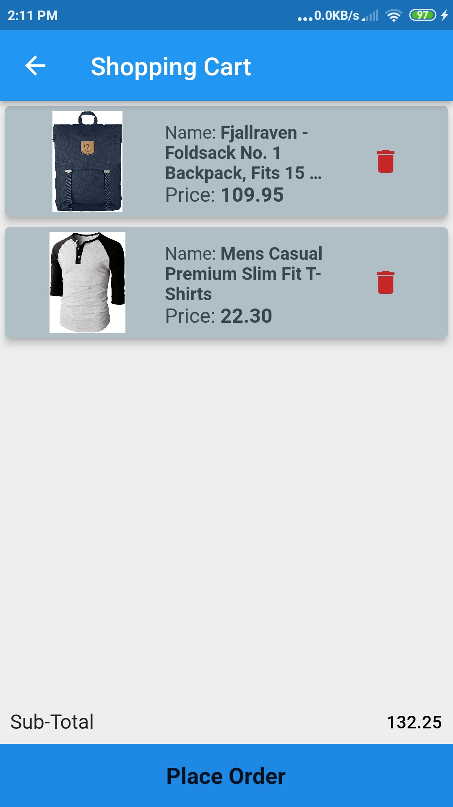

# flutter_cart [Welcome]

A simple flutter shopping application.

<a href="./app-release.apk"></img></a>

# 📸 Screenshots
The screenshots below are taken on a android device.

| Login | Home |
|------|-------|
|||

| Category1 | Category2 |
|------|-------|
|||

| Detail | Cart|
|------|-------|
|||

# ✨ Requirements
- Any Operating System (ie. MacOS X, Linux, Windows)
- Any IDE with Flutter SDK installed (ie. IntelliJ, Android Studio, VSCode etc)
- A little knowledge of Dart and Flutter
- Some fingers to code 😂

## What's inside

- Routing
- State Management using [Provider](https://pub.dev/packages/provider)
- Authentication and Keep User Login using [Hive](https://pub.dev/packages/hive)
- Cards, List Items
- Horizontal ListView, GridView
- Cart items Stored on locally using [Hive_Flutter](https://pub.dev/packages/hive_flutter)
- Api Request using [Http](https://pub.dev/packages/http)
- Internet Data Connection using[internet_connection_checker](https://pub.dev/packages/internet_connection_checker) 

# Getting Started

#### 1. Clone and Install

```bash
# Clone the repo
git clone https://github.com/safvanp/Flutter_Cart.git

# Navigate to clonned folder and Install dependencies
cd flutter_cart && flutter packages get
```

This project is a starting point for a Flutter application.

A few resources to get you started if this is your first Flutter project:

- [Lab: Write your first Flutter app](https://flutter.io/docs/get-started/codelab)
- [Cookbook: Useful Flutter samples](https://flutter.io/docs/cookbook)

For help getting started with Flutter, view our 
[online documentation](https://flutter.io/docs), which offers tutorials, 
samples, guidance on mobile development, and a full API reference.
=======
For help getting started with Flutter development, view the
[online documentation](https://docs.flutter.dev/), which offers tutorials,
samples, guidance on mobile development, and a full API reference.

